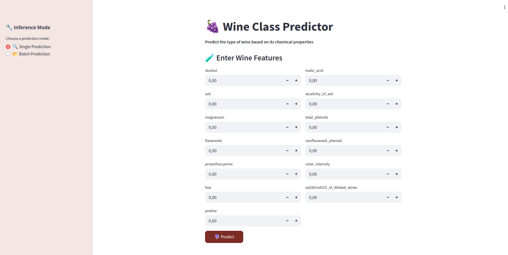
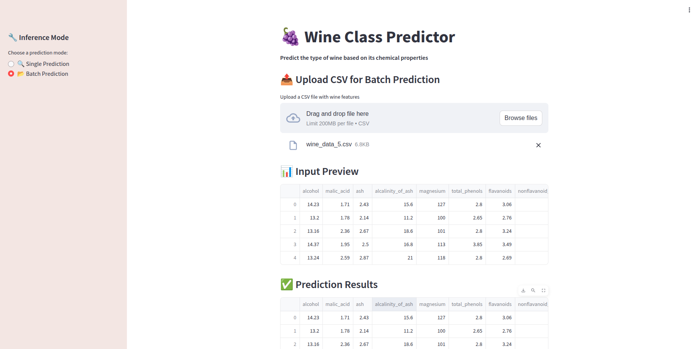
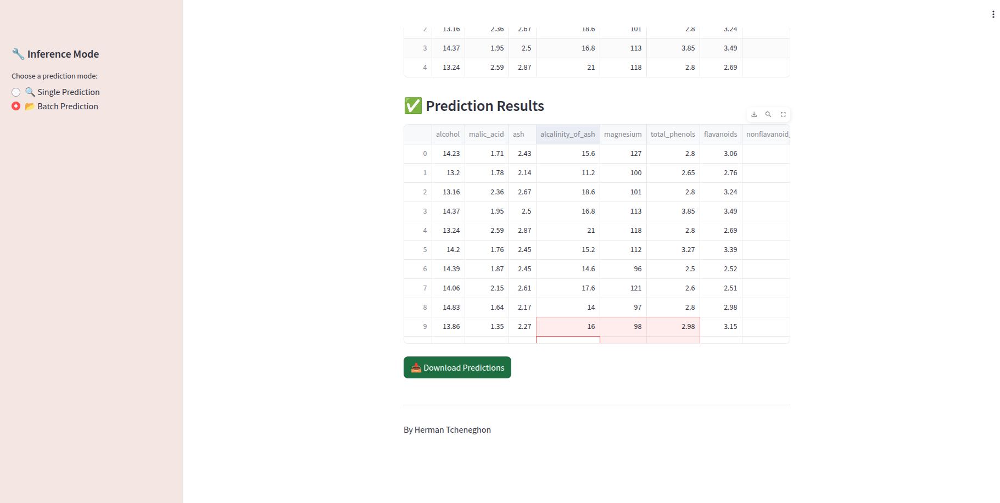

# ML-PROJET-WITH-DOCKER

This project is a complete Machine Learning pipeline that includes model training, batch predictions, and an interactive web app using **Streamlit**, **DVC**, and **Docker**. It also integrates with **DagsHub** for version control and experiment tracking.

---

## Features

- Train a Gradient Boosting model on the Wine dataset
- Store and version data/models with **DVC**
- Run batch predictions on uploaded `.csv` files
- Use a clean and interactive **Streamlit** interface
- Fully reproducible thanks to **Docker**
- Use of a centralized configuration with `config.yaml`

---
 
## 📁 Project Structure

```text
ML-PROJET-WITH-DOCKER/
│
├── app/
│   ├── training/
│   │   └── train_model.py              # Script to train and save the model
│   ├── model/
│   │   ├── load_model.py               # Load model from file
│   │   └── predictor.py                # Make predictions using the model
│   ├── streamlit_app.py                # Streamlit web application
│   ├── utils.py                        # Utility functions
│   └── dvc_utils.py                    # DVC utility integration
│
├── data/                               # Raw input data (tracked by DVC)
├── models/                             # Trained models (tracked by DVC)
│   └── gradiant_boosting_model.pkl     # Trained Gradient Boosting model
├── uploads/                            # Uploaded files via Streamlit
│
├── .dvc/                               # DVC internal files
├── .venv/                              # Python virtual environment (excluded)
├── .env                                # Environment variables
├── Dockerfile                          # Docker image definition
├── config.yaml                         # Centralized parameters and paths
├── requirements.txt                    # Python dependencies
├── dvc.yaml                            # DVC pipeline definition
├── dvc.lock                            # DVC stage locks for reproducibility
└── README.md                        
```
## 🐳 Docker Usage

### 🔧 Build the image

```bash
docker build -t ml-docker-app .
```
### 🔧 Run de Streamlit app
docker run -p 8501:8501 ml-docker-app


## 📦 DVC Pipeline
We use DVC to track data and model versions, and define reproducible pipelines.


### Train model with DVC

```bash
dvc repro
```
### ➕ Add new stages (example)

```bash
dvc stage add -n train_model \
  -d app/training/train_model.py \
  -d config.yaml \
  -o models/gradiant_boosting_model.pkl \
  python3 app/training/train_model.py

```
## DagsHub Integration
This project can be synced with DagsHub to manage:

✅ Data & model versioning

✅ Experiments tracking with MLflow

✅ Git/DVC repository hosting

https://dagshub.com/Herman-Motcheyo/ML-Project-Docker

